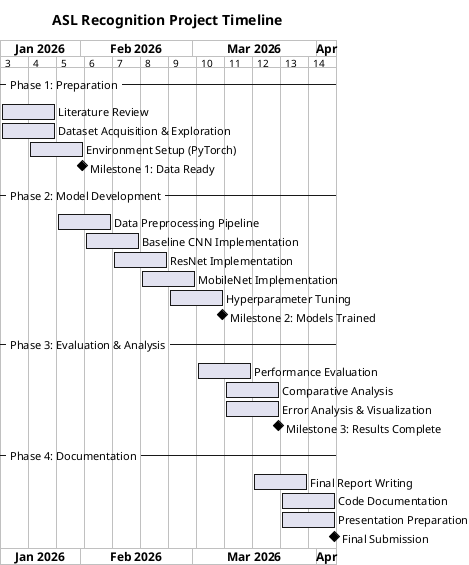
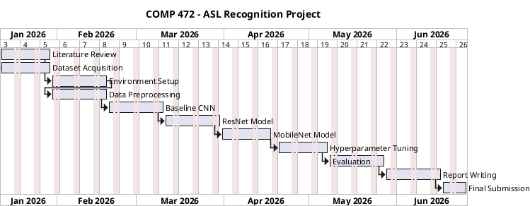

# Project Timeline: ASL Recognition Using CNNs

**Course:** COMP 472: Applied Artificial Intelligence  
**Term:** Winter 2026

---

## Gantt Chart (PlantUML)

---

## Alternative: Simplified PlantUML Gantt

---

## Key Milestones

| Milestone | Week | Deliverables |
|-----------|------|--------------|
| **M1: Data Ready** | 3 | All three datasets downloaded, explored, and preprocessed; development environment configured |
| **M2: Models Trained** | 9 | Baseline CNN, ResNet, and MobileNet trained on all three datasets; hyperparameters optimized |
| **M3: Results Complete** | 12 | All evaluation metrics computed; comparative analysis across datasets and models completed |
| **Final Submission** | 14 | Final report, documented codebase, and presentation materials submitted |

---

## Task Breakdown

### Phase 1: Preparation (Weeks 1-3)
- [ ] Conduct literature review on ASL recognition and CNN architectures
- [ ] Download and explore all three datasets
- [ ] Set up PyTorch development environment
- [ ] Create data loading utilities

### Phase 2: Model Development (Weeks 4-9)
- [ ] Implement data preprocessing pipeline (resize, normalize, augment)
- [ ] Build and train baseline CNN architecture
- [ ] Implement and fine-tune ResNet-18/50 with transfer learning
- [ ] Implement and fine-tune MobileNetV2
- [ ] Perform hyperparameter optimization (learning rate, batch size, etc.)

### Phase 3: Evaluation & Analysis (Weeks 10-12)
- [ ] Evaluate all models on all three datasets
- [ ] Compute accuracy, F1-score, confusion matrices, ROC-AUC
- [ ] Perform comparative analysis across models and datasets
- [ ] Analyze common error patterns and failure cases
- [ ] Create visualizations (training curves, confusion matrices, sample predictions)

### Phase 4: Documentation (Weeks 12-14)
- [ ] Write final project report
- [ ] Document codebase with comments and README
- [ ] Prepare presentation slides
- [ ] Submit all deliverables

---

## How to Render PlantUML

You can render the Gantt chart using:

1. **PlantUML Online Server**: https://www.plantuml.com/plantuml/uml/
2. **VS Code Extension**: Install "PlantUML" extension
3. **Command Line**: `java -jar plantuml.jar Gantt_Chart.md`
4. **Jupyter Notebook**: Use `plantuml` magic with iplantuml package
